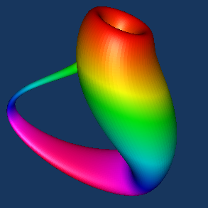
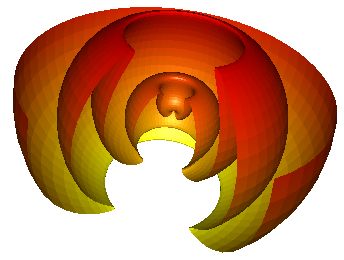
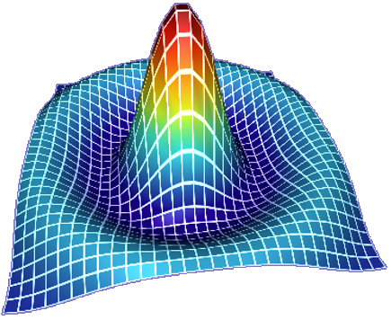
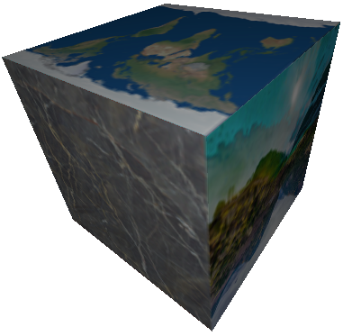
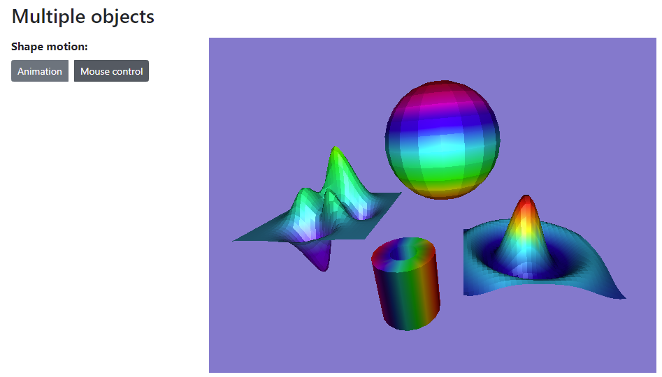
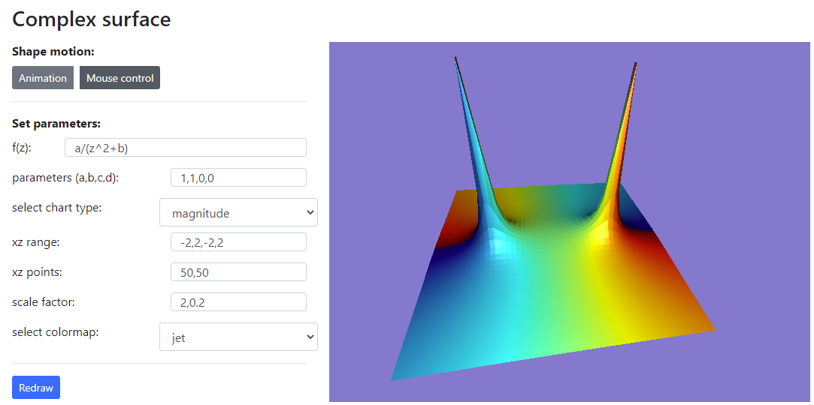
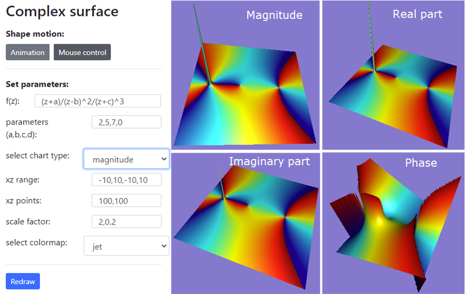

# WebGPU 图形编程免费视频教程 

WebGPU 是下一代图形 API 以及未来图形和计算的网络标准. 它的目标是提供带有 GPU 加速功能的现代三维图形和计算。为了帮助你熟悉这个新的图形 API 并能够利用它开发 WebGPU 应用，我计划制作一个关于 WebGPU 编程的 YouTube 视频系列。在每一期视频中，我们将详细讨论一个容易理解的 WebGPU 应用程序。这个存储库中将包括 YouTube 视频系列中所使用的范例的所有原代码。 

在这个 YouTube 视频系列中，我们将用现实的范例应用程序来阐述 WebGPU 的基础知识，着色器程序，GPU 缓冲区，以及渲染管道。从这个视频系列中， 你将能够学到如何在 WebGPU 中创建基元和简单的图形。随着你通过这个视频系列的学习， 你将逐步掌握 WebGPU 的各种高等技能，其中包括三维变换，光计算，色彩调配和纹理匹配。同时， 你还将学习如何构建高级的三维 WebGPU 物体, 其中包括三维线框， 三维形状，简单和参数化三维曲面，以及由复函数描述的三维曲面图和分形图形。此外，我们还将探索新的 WebGPU 功能，比如计算着色器和存储缓冲区，以及如何使用它们来模拟大型粒子系统。

在看完本视频系列后，你将具备使用 WebGPU API 在网络上构建自己的具有 GPU 加速功能的图形和计算所需的各种技能。 

在这个视频系列中所用到的例子大部分取自我最近出版的新书 “Practical WebGPU Graphics". 详情可见 https://drxudotnet.com or https://book.gincker.com.  

## Youtube 视频链接

1. 建立开发环境： **https://youtu.be/wT8IGK0KA1E**
2. 构建一个单色三角形： **https://youtu.be/SMzw0XH83CA**
3. 构建一个具有不同颜色的三角形：**https://youtu.be/JECieX8_v1Y**
4. 用GLSL着色器构建一个具有不同颜色的三角形： **https://youtu.be/0-h2_l1sYEU**

## 实例
以下是一些使用 WebGPU API 构建的图形实例。我会在我的视频里详细讲解和讨论这些例子。

### Klein 瓶子:

### Wellenkugel 三维曲面:  
 

### 3D Sinc 曲面:
 

### 具有多重纹理的三维立方体:
 

### 多个物体在一个场景中:
 

### 复函数三维表面图:
 

### 另一个复函数三维表面图:
 

## 应用的构建

本存储库使用 git 子模块安排所有示例。这些示例应用程序使用TypeScript构建，并使用 WebPack 捆绑。 构建应用程序需要安装Node.js。

你可按照以下步骤运行示例应用:

* 仔细观看第一期视频( **https://youtu.be/wT8IGK0KA1E** )，构建正确的开发环境。
* 点击您感兴趣的示例应用的链接.
* 将应用实例克隆或下载到本地计算机上.
* 使用以下命令安装依赖项: **npm install**.
* 使用以下命令编译并捆绑应用: **npm run dev**, **npm run prod**, 或 **npm run watch**.
* 从VS-Code中运行实时服务器，然后用浏览器导航到 **http://localhost:5500** 或 **http://127.0.0.1:5500** 去查看应用示例.

## 许可 (License)

The MIT License (MIT).

Copyright (c) 2021 Jack Xu.

Permission is hereby granted, free of charge, to any person obtaining a copy of this software and associated documentation files (the "Software"), to deal in the Software without restriction, including without limitation the rights to use, copy, modify, merge, publish, distribute, sublicense, and/or sell copies of the Software, and to permit persons to whom the Software is furnished to do so, subject to the following conditions:

The above copyright notice and this permission notice shall be included in all copies or substantial portions of the Software.

THE SOFTWARE IS PROVIDED "AS IS", WITHOUT WARRANTY OF ANY KIND, EXPRESS OR IMPLIED, INCLUDING BUT NOT LIMITED TO THE WARRANTIES OF MERCHANTABILITY, FITNESS FOR A PARTICULAR PURPOSE AND NONINFRINGEMENT. IN NO EVENT SHALL THE AUTHORS OR COPYRIGHT HOLDERS BE LIABLE FOR ANY CLAIM, DAMAGES OR OTHER LIABILITY, WHETHER IN AN ACTION OF CONTRACT, TORT OR OTHERWISE, ARISING FROM, OUT OF OR IN CONNECTION WITH THE SOFTWARE OR THE USE OR OTHER DEALINGS IN THE SOFTWARE.
 
