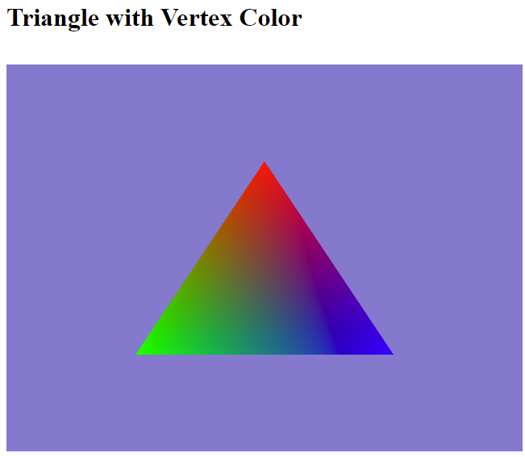

# Step-by-Step WebGPU Graphics Programming (3) 
## Create Triangle with Different Vertex Colors 

This is the source code for the third part of a series YouTube videos on step-by-step WebGPU graphics programming.

This sample WebGPU app creates a triangle with different color on each vertext. The output from the app is shown in the following image.

